= методические указания по разработке этапов курсового проекта

:author: Ульянов Роман Дмитриевич
:date: 26.05.2020
:version: 1.0
:email: mstr.calling@gmail.com 
:toc: right

[.text-center]
== [brown]#Краткое описание этапов курсового проектирования.#

[.text-justified]
&#160;  В данном методическом пособии дано описание по написанию курсового проекта на тему «Создание базы данных» в среде MySQL. Курсовой проект разделен на шесть этапов, этапы и их характеристика перечислены ниже. 

[.text-center]
=== *Список основных этапов курсового проектирования*

[.text-left]
. *этап 1*. Этап включает в себя: выбор темы для разработки; описание целей и задач, решаемые в подсистеме хранения данных; описание предметной области; Описание пользователей разрабатываемой подсистемы; начальную оценку выделения сущностей (таблиц) и атрибутов (полей) каждой сущностей; разработка словаря предметной области, включающего основные понятия информационной системы, а также описание сущностей и атрибутов.
. *Этап 2*. Этап включает в себя: демонстрацию знаний теории нормализации таблиц информационной системы; изучение теории нормализации; выделение и описание связей между сущностями, выделенными на первом этапе; построение физической и логической модели базы данных.
. *Этап 3*. Этап включает в себя: описание и реализацию функционала базы данных. Вам необходимо выделить, описать работу и реализацию функций, процедур, триггеров, которые, по Вашему мнению должны присутствовать в ИС. Например, функция вычисления стоимости заказа, триггер, обрабатывающий добавление, изменение и удаление таблицы «Состояние заказа» и т.д.
. *Этап 4*. Этап включает в себя: окончательную реализацию всех объектов, описанных в базе данных и демонстрацию работы реализованного функционала в виде скриншотов. На данном этапе должна сформироваться реализованная модель с описанием, два следующих этапа представляют собой оформление документации.
. *Этап 5*. Этап включает в себя: оформление пояснительной записки, раскрывающей проделанную работу и оформленную согласно стандартам. Чтобы подготовиться к защите, Вам необходимо предоставить выполненный курсовой проект. Вам необходимо предоставить в папке скоросшивателе следующие материалы: титульный лист; лист задания; аннотация на английском и русском языках; содержание (с рамкой); разделы пояснительной записки (с рамками); приложения (без рамок); графический материал в отдельном файле; подписанный диск в конверте, подшитый к папке и содержащий разработанные коды, пояснительную записку, графический материал и презентацию.
. *Этап 6, заключительный*. Этап включает в себя: сдачу пояснительной записки, оформленной согласно требованиям, описанным в пятом этапе, и защита курсового проекта по подготовленной презентации. Учитывайте, что на защиту отводится 5 минут, поэтому подготовьте презентацию, четко отражающую структуру проделанной работы.

[.text-left]
&#160; При выкладывании этапов используйте приложенный шаблон оформления и называйте документы в формате:

----
<Шифр группы>#КП#<Номер этапа>-Фамилия студента
----
[.text-left]
Например: ПРИ-118-КП#01-Иванов.docx.
[.text-center]
== [brown]#Этап 1#
[.text-left]
=== *Цель этапа*
&#160; Целью данного этапа является определение темы разрабатываемой информационной системы для реализации, начальное выделение сущностей, определение пользователей разрабатываемой подсистемой хранения данных и подготовка словаря предметной области.
[.text-left]
=== *Введение*

&#160; Приступая к выполнению данного этапа, Вы должны лишь определиться с темой для курсового проекта и системой, в которой будете его реализовывать. Примером для демонстрации выполнения этапов будет служить информационная система «Магазин компьютерной техники», а средой для реализации – MySQL. Но Вы можете выбрать собственную тему и среду для реализации, СУБД. Доступны такие программы, как Oracle DB, MySQL, Microsoft SQL Server, PostgreSQL, PhpMyAdmin и другие программы. Все программы для работы с базами данных по архитектуре делятся на два типа: имеющие файл-серверную архитектуру, такие как MS Access, и клиент-серверную, такие как MySQL. Вам необходимо выбрать программу, имеющую архитектуру второго типа. Скачать MySQL можно с официального сайта компании Oracle. +
&#160; Данный этап является наиболее важным из всех этапов курсового проекта, поскольку он является отправной точкой для создания следующих этапов. При создании следующих этапов курсового проектирования, может возникнуть необходимость изменения модели разрабатываемой ИС атрибута сущности, добавление или удаление сущности, связи между ними. Необходимо, чтобы все этапы отражали созданные изменения, чтобы не возникло рассинхронизации данных в этапах, а дальнейшее использование этапов для разработки БД после изменения структуры БД не вызывало затруднений.

[.text-left]
=== *Цели и задачи, решаемые подсистемой хранения данных*
&#160; На данном этапе необходимо выделить цели, которая должна выполнять разрабатываемая вами информационная система. Задайтесь вопросом: зачем разрабатывается данная информационная система? Какие действия она должна выполнять? Возможно, целью разработки является автоматизация процессов работы некоторого предприятия, или же хранение данных о студентах, которые учатся в некотором университете. В зависимости от этого функциями системы могут быть сбор данных о материалах, которые присутствуют на складе предприятия, либо же получение списка студентов определенной группы. Без четкого представления целей и задач, которая решает разрабатываемая Вами ИС, дальнейшая ее разработка невозможна. Ниже представлен пример описания цели для ИС «Магазин компьютерной техники».

&#160;  _Цель работы:_ разработать подсистему хранения данных, которая будет позволять сохранять фактические данные о поступивших товарах и сотрудниках в магазине компьютерной техники.

&#160; _Для достижения поставленной задачи необходимо решить:_

. хранение данных о товарах в магазине компьютерной техники;
. хранение данных о сотрудниках, работающих в магазине компьютерной техники;
. хранение данных о должностях всех работающих сотрудников в магазине компьютерной техники;
. хранение данных о фирмах поставщиках, которые предоставляют товар данной компании;
. хранение данных о заказах в данном магазине;
. функция сбора информации выполненных заказах;

[.text-left]
=== *Описание предметной области*

&#160; Описав цели, необходимо определиться с описанием предметной области. Необходимо изучить разрабатываемую предметную область и затем описать ее. Представьте, что Вы оказались в разрабатываемой информационной системе. Вы – сотрудник компании или студент университета. Вам необходимо объективно описать работу информационной системы: например, для ИС «Магазин компьютерной техники», можно описать режим работы, описать должности сотрудников, поэтапно расписать процесс оформления заказа. Для ИС «Библиотека» можно описать режим работы, список возможных должностей (библиотекарь, главный библиотекарь, помощник библиотекаря), список книг, которые присутствуют в библиотеке – есть разные виды библиотек: в публичных библиотеках присутствуют книги для широкого круга людей, ими пользуются все без исключения; в специализированной библиотеке может присутствовать специальная литература: технического направления, литература для слепых, и т. д. Опишите потребителей информационной системы – тех, кто будет использовать разработанную информационную систему. Это может быть библиотекарь, сотрудник магазина, покупатель, читатель, работник университета. Представьте себя на его месте: удобно ли вам будет использовать разработанную систему. +
&#160; В качестве прототипа модели ИС можно создать базу данных в среде MS Access, установить связи, определить атрибуты, связи между ними. В дальнейшем при создании схемы данных можно будет использовать программу MySQL Workbench, IDE для разработки СУБД с архитектурой клиент-сервер, или MS Visio. Рекомендуется использовать первый вариант, поскольку адекватно собранная и нормализованную модель можно экспортировать непосредственно в MySQL, не прописывая запросы на создание таблиц. Такой стиль разработки называется Model First, но в процессе создания курсового проекта рекомендуется использовать MySQL Workbench только для создания модели данных, поскольку целью курсового проекта также является изучение синтаксиса языка Structured Query Language (SQL). Также MySQL Workbench идет в комплекте устанавливаемых программ MySQL от компании Oracle, и установка связей не представляет больших проблем.

[.text-left]
=== *Пользователи разрабатываемой подсистемы*

&#160; На данном этапе необходимо определить роли сотрудников, которые присутствуют в данной ИС. Например, в ИС «Магазин компьютерной техники» присутствуют следующие пользователи: (список). Ниже приведен пример описания должности для сотрудника ИС, именующего должность «продавец»: +
_продавец_ – продает товары, обновляет сведения опроданныхтоварах.Может просматривать информацию о товарах и заказах, добавлять, изменять оформленный им или удалять оформленный им заказ; добавлять, удалять товар, изменять сведения об их количестве; +
&#160; важно четко понимать, за что отвечает данный сотрудник и как велика по важности его роль в команде. Например, продавец – продает товары, изменяет их количество, но добавлять или удалять товары он не может – за это отвечает главный продавец. Понимание четкого разграничения поможет Вам без особых проблем задать привилегии для всех должностей и аргументировать свой выбор. Также при описании должностей старайтесь не включать в список пользователей сотрудников, которые имеют должности, не связанные с разрабатываемой ИС, т.е. в рамках разрабатываемой ИС они имеют неопределенные права. Например, у магазина компьютерной техники есть свой сайт, поэтому в ходе анализа выделяется пользователь, имеющий должность «Модератор». Его роль в команде состоит в обновлении контента на сайте. Но это противоречит целям и задачам, описанным в первом пункте этапа. Разрабатываемая система должна лишь хранить данные о сотрудниках компании, их, должностях, заказа, товарах, а также предоставлять сведения о них по запросам сотрудникам и покупателям. Также не стоит выделять несуществующих пользователей, таких как пользователь «студент» в разрабатываемой ИС «Магазин компьютерной техники». Если студент пришел на подработку в магазин, он определяется как «Сотрудник», в то время как пользователь «студент» может быть определен в рамках разрабатываемо ИС «Университет».
[.text-left]
=== *Начальная оценка и выделение сущностей*
&#160;  Выделив пользователей разрабатываемой подсистемы, необходимо провести более глубокий анализ предметной области. Запишите сюда все ключевые слова, связанные с разрабатываемой Вами ИС. Сюда можно включить список атрибутов, которые были разработаны в ходе проектирования прототипа в среде MS Access, а также термины, которые встречаются в рамках данной предметной области. Выделив сущности, перечислите их в виде списка и перенесите их в словарь предметной области. Не забудьте, что при изменении названия, добавления или удаления атрибута или сущности в БД, а также выделение или удаление ключевого слова, характеризующую разрабатываемую вами ИС, добавления или удаления пользователя, синхронизировать данные во всех этапах курсового проекта.

[.text-left]
=== *Словарь предметной области*

&#160; В заключительном пункте данного этапа необходимо составить словарь предметной области. Он представляет собой подробное описание выделенных сущностей, выделенных в предыдущем пункте данного этапа. Важно грамотно описать каждую сущность, чтобы исключить недопонимания при дельнейшей разработки. Также грамотно составленный словарь предметной области позволит новым сотрудникам, которые присоединятся к разработке, понять значения сущностей, атрибутов, определение должностей пользователей и привилегии, которые они имеют в рамках разрабатываемой информационной системы. При составлении словаря предметной области отдельно отделите сущности ИС, поскольку для них будет представлен иной стиль описания, нежели для атрибутов и ключевых терминов. Для описания сущностей используйте следующий шаблон:

----
 Название сущности – описание сущности; название на английском языке, используемое при разработке: <название>.
 Атрибуты: <атрибут[1],атрибут[2],…,атрибут[n]>.
 Название сущности – описание сущности; название на английском языке, используемое при разработке: <название>.
 Атрибуты: <атрибут[1],атрибут[2],…,атрибут[n]>.
----

&#160; Пример описания сущности «Сотрудники компании»:

----
 Сотрудники компании – множество данных, представляющее собой список всех сотрудников компании; название на английском языке, используемое при разработке: CompanyEmloyees.
 Атрибуты: ID, номер сотрудника, ФИО сотрудника, должность, адрес, телефон.
----

&#160; Для описания ключевых элементов и атрибутов используйте следующий шаблон:

----
 Название атрибута [ключевого элемента]: описание; [описание]; название на английском языке, используемое при разработке: <название>.
----
 
&#160; Пример описания атрибута «Адрес» в ИС «Магазин компьютерной Техники»:

----
 Адрес – адрес магазина, фирмы поставщика, сотрудника компании; атрибут сущностей «Сотрудники компании», «Фирмы поставщики», «Заказы»; название на английском языке, используемое при разработке: Address.
----

[IMPORTANT]
====
Если название атрибута встречается в нескольких сущностях, то используйте последовательное описание, разделяя описание символом точка с запятой (;). 
====

Если название атрибута встречается в нескольких сущностях, то используйте последовательное описание, разделяя описание символом точка с запятой (;). 
[.text-center]
== [brown]#Этап 2#
[.text-left]
=== *Цель этапа*

&#160; Целью данного этапа является демонстрация знаний теории нормализации, выделение и описание связей между сущностями, построение физический и логической модели БД.
[.text-left]
=== *Введение*
&#160; Процесс нормализации БД является важным этапом при создании БД. На данном этапе устанавливаются связи между атрибутами, перевод отношений от первой нормальной формы к нормальным формам более высокого уровня. При нормализации исключается дублирование атрибутов, различные аномалии в БД. Выделяют иерархическую, сетевую и реляционную модель БД. При разработке БД в СУБД MySQL вы будете иметь дело с реляционной моделью, которая представляет БД как набор таблиц с установленными связями между ними. Ниже приведены основные понятия реляционной модели БД:

&#160; _Сущность_ – таблица БД, содержащая набор связанных атрибутов;

&#160; _Атрибут_ – поля, колонки таблиц, описывающее некоторую сущность;

&#160;  __Кортеж__ – строка данных в таблицах, множество значений атрибутов, описывающих некоторую сущность;

&#160; __Отношение__ – совокупность атрибутов (столбцов) и кортежей (строк) в сущности (таблице), на пресечении которых содержатся атомарные значения, которые невозможно разделить без потери смысла. Выделяют заголовок отношения, состоящего из набора атрибутов, и тело отношения, включающее множество кортежей;

&#160; _степень отношения_ – количество атрибутов (столбцов) в отношении;

&#160;  __Кардинальное число__ – количество кортежей в отношении;

&#160; __Потенциальный ключ__ – совокупность атрибутов, однозначно характеризующий множество кортежей в ней. Разделяют _простые потенциальные ключи__, состоящие из значений атрибутов, уникально идентифицирующих запись в таблице, и __составные потенциальные ключи__, состоящие из группы атрибутов, уникально идентифицирующих каждый кортеж сущности. Примером простого потенциального ключа может служить значения атрибута «ID сотрудника компании» сущности «Сотрудники компании» ИС «Магазин компьютерной техники»; примером составного потенциального ключа является совокупность значений атрибутов «Серия документа» и «Номер документа» сущности, в которой хранятся паспортные данные. При применении составных потенциальных ключей в таблице, необходимо быть уверенным, что потенциальный ключ не должен быть избыточным, т.е. любое подмножество, входящее в его состав, не должно обладать свойством уникальности. Например, пример составного потенциального ключа, приведенный выше, не является избыточным, поскольку по отдельности значения атрибутов, определяющих серию и номер паспорта, уникальностью не обладают. Но избыточным будет применение составного потенциального ключа, состоящего из значений атрибутов «Номер зачетной книжки» и «Номер СНИЛС» некоторой сущности, хранящих данные о студентах, обучающихся в университете. При наличии более одного потенциального ключа в определенной сущности, имеет смысл один из них определить __первичным ключом (Primary Key)__, а в другой сущности – значения атрибута, на который ссылается данный потенциальный ключ, задать _внешним_ или __альтернативным ключом (Foreign Key)__. Причем сущность, включающая атрибут, содержащая множество первичных ключей, называется __ссылочной__, а сущность, содержащую атрибут, каждое значение которого связано некоторым отношением с множеством значений атрибута другой сущности, называется __ссылающейся__. Также при установке отношений избегать появления __рекурсивных отношений__, когда атрибут ссылающейся сущности некоторым образом связан с множеством значений атрибутов, содержащих первичные ключи этой же сущности. В ИС «Магазин компьютерной техники» примером ссылочной таблицы является таблица «Должности», содержащая информацию о должностях сотрудников, а примером ссылающейся таблицы является «Сотрудники компании», которая содержит атрибут «Должность сотрудника», каждый элемент которого ссылается на множество первичных ключей ссылочной таблицы «Должности».
&#160; _Нормализация_ – процесс разделения таблицы на две или более частей для обеспечения оптимальной работы с ней: добавления, удаления, поиска данных. Выделяют шесть нормальных форм отношений БД.

*шесть нормальных форм*

. _Первая нормальная форма (First normal form)_ – тип отношения, при которой все атрибуты являются простыми и находятся в зависимости от одного первичного ключа. Чтобы составить таблицу в 1НФ, добавьте ключевое поле ID и перечислите атрибуты всех сущностей, разрабатываемой  ИС.
. _Вторая нормальная форма (Second normal form)_ – тип отношения, при котором выполняется условия существования 1НФ, а также каждый неключевой атрибут неприводимо зависит от первичного ключа, т.е. невозможно выделить подмножество атрибутов из потенциального ключа, которое будет находиться в данной функциональной зависимости. Для нормализации до второй нормальной формы разделите атрибуты, полученные во второй сущности так, чтобы каждая сущность имела свой уникальный неприводимый потенциальный ключ.
. _Третья нормальная форма (Third normal form)_ – тип отношения, при котором выполняется условие существования 2НФ, а также каждый неключевой атрибут сущности нетранзитивно зависит от первичного ключа. Нетранзитивная зависимость означает, что каждое любое из трех атрибутов, сущности А (x ~1~ , y~1~ , z~1~ ) связано некоторым отношением с атрибутами (x ~2~,y ~2~,z ~2~) сущности B, причем, в отличии от транзитивной зависимости, отношение выполняется и в обратную сторону. Для приведения таблиц к третьей нормальной форме модифицируйте сущности разрабатываемой системы так, чтобы каждое отношение, связывающее сущности, выполнялось обоюдно и не вызывало логических противоречий.
. _Усиленная третья нормальная форма, нормальная форма Бойса-Кодда (Boyce–Codd normal form)_ – форма отношения между сущностями, при котором выполняются условие существования 3НФ, а также каждая неприводимая функциональная зависимость обладает потенциальным ключом в качестве своего определителя. Условием применения нормальной формы Бойса-Кодда является наличие у отношения следующих характеристик:
* Отношение имеет два или более потенциальных ключа;
* Данные потенциальные ключи являются составными;
* Присутствует пересечение атрибутов потенциальных ключей, т. е. имеется один общий атрибут у обоих составных ключей;

. _Четвертая нормальная форма (Fourth normal form)_ – форма отношения между сущностями, при которой выполняется условие существования НФБК, а также каждая неприводимая зависимость между атрибутами. Например, в результате применения нормализации сущности «Должности» ИС «Магазин компьютерной техники» четвертой нормальной формы, имеющей атрибуты «ID», «Должность», «Описание», будет появление дополнительных сущностей «Должность», имеющая атрибуты «ID», «Название должности», и «Описание», имеющая атрибуты «ID», «Описание должности»,  а атрибуты «Должность» и «Описание» сущности «Должности» будет содержать внешние ключи на множество первичных ключей ID сущностей «Должность» и «Описание». Таким образом, сформируются функциональные зависимости: «Должность»→«ID[Должность]», «Описание»→«ID[Описание]». Такое приведение порождает множество лишних связей, которые затрудняют разработку и эксплуатацию проекта.
. _Пятая нормальная форма (First normal form)_ – форма отношения, при которой выполняется условие существования 4НФ, а также все атрибуты связаны при помощи простых связей. Если в некоторой сущности атрибут A зависит от атрибута B, атрибут B зависит от атрибута C, а также атрибут C зависит от атрибута A, то все эти три атрибута являются частью одного кортежа. На практике применение 5НФ требует существование определенных труднодостижимых условий, поэтому 5НФ применяется очень редко, если не применяется совсем.
. __ER диаграмма, Entity Relationship diagram__, диаграмма сущность-связь – диаграмма, отражающая физическую и логическую модель данных в виде структуры или в виде графического представления.

[NOTE]
====
В практической деятельности нормализация БД выполняется до третьей или, при необходимости, до усиленной третьей нормальной формы. Дальнейшая нормализация является избыточной и в основном не применяется.
====

=== *Основные сведения по теории нормализации*

&#160; В данном этапе необходимо раскрыть Ваше понимание теории нормализации баз данных. Включите сюда определения из пункта «введение» данного этапа и выучите их.
[.text-left]
=== *Результат применения аппарата теории нормализации*

&#160; На данном этапе необходимо показать понимание аппарата теории нормализации. Необходимо представить атрибуты БД в виде сущности в первой нормальной форме и затем последовательно нормализовать данную сущность до второй нормальной формы, а затем до третьей нормальной формы и, при наличии составных потенциальных ключей, до усиленной третьей нормальной формы (НФБК). При нормализации напишите пояснение применения процесса нормализации, при необходимости используйте материалы из пункта «Введение» или интернет ресурсы. Ниже приведен пример, иллюстрирующий результат применения аппарата теории анализа для ИС «Магазин компьютерной техники».
В базе данных ИС «Магазин компьютерной техники» сущности приведены к третьей нормальной форме. Первоначальное представление данных в первой нормальной форме отображает таблица 1. Данное представление неприемлемо, поскольку присутствует дублирование атрибутов: данные о сотрудниках, фирмах поставщиках и товарах содержатся в одной сущности. Также на данном этапе нормализации невозможно организовать работу с данными. Все атрибуты таблицы непосредственно зависят от потенциального ключа – первичного ключа ID. examle {email} 

.Пример модели в 1 норммальной форме
[width="80%", horizontal ,options="header"]
|====================
| ID |  
|  Шифр заказа|  
|  Шифр товара|  
|  Фирма поставщик|  
|  Название фирмы|  
|  Адрес |  
|  Описание|  
|  Название товара|
|  Поставлено на склад|  
|  Текущее количество товара на складе (баланс)|  
|  Стоимость одной единицы товара (цена)|  
|  Рейтинг продаж|  
|  Наличие|  
|  Описание|  
|  Количество товара на складе|  
|  Промежуточная стоимость|  
|  Шифр сотрудника|  
|  ФИО сотрудника|  
|  Должность|  
|  Описание|  
|  Адрес|  
|  Контактный телефон|  
|  Количество заказанных товаров|  
|  ФИО заказчика|  
|  Стоимость заказа|  
|  Способ доставки|  
|  Адрес доставки|  
|  Контактный телефон|  
|====================

&#160; Чтобы разделить данные, применено приведение ко второй нормальной форме, результат нормализации демонстрируют таблицы 2, 3 и 4. Ниже приведены таблицы данных БД во 2 нормальной форме. В результате данные были разделены на сущности «Заказы», «Товары», «сотрудники компании». Ссылающаяся сущность «Заказы» имеет внешние ключи, представленные в виде множества значений атрибутов «Шифр товара» и «Шифр заказа», которые связаны при помощи связи один ко многим с сущностями «Товары» и «Сотрудники компании». Однако, данная модель нормализована до второй нормальной формы, поскольку присутствуют транзитивные связи: «Шифр товара»→«Адрес» и «Шифр сотрудника» →«Описание». Несмотря на то, что элементы атрибутов «Адрес» сущности «Товары» и элементы атрибута «Описание» сущности «Сотрудники компании» неприводимо зависят от множества значений первичного ключа, содержащихся в атрибуте ID, невозможно установить адекватную логическую связь между внешними ключами ссылающейся таблицы «Заказы» и ссылочными таблицами «Сотрудники компании» и «Товары». Товар не имеет адреса, адрес имеет фирма поставщик – отдельная сущность, атрибуты которой намеренно не отделены от сущности «Товары» на данном этапе нормализации для демонстрации транзитивной связи. Аналогично невозможно установить нетранзитивную связь между связанными атрибутами «Шифр сотрудника» таблицы «Заказы» и атрибутом «Описание» таблицы «Сотрудники компании». Данный атрибут характеризует описание должности сотрудника – отдельной сущности, которая также не была выделена в результате нормализации для демонстрации наличия нелогичных транзитивных связей в модели. Также, в третьем этапе, при выделении сущностей «Должности» и «Фирмы поставщики» необходимо удалить из сущностей «Товары» и «сотрудники компании» атрибуты, раскрывающим выделенные сущности, за исключением атрибутов «Название фирмы» и «Должность», которые станут внешними ключами, ссылающимися на множество значений первичных ключей выделенных сущностей, для избегания дублирования данных:

.Таблица "Заказы". Вторая нормальная форма
[width="80%",horizontal, options="header"]
|====================
|ID  |  
| Шифр заказа |  
| Шифр товара |  
| ID сторудника компании |  
| Количество единиц товара |  
| Промежуточная стоимость|  
| Количество заказанных товаров |  
| ФИО заказчика |  
| Стоимость заказа |  
| Способ доставки |  
| Адрес доставки |  
| Контактный телефон |  
|====================

.Таблица "Товары". Вторая нормальная форма
[width="80%",horizontal, options="header"]
|====================
| ID |  
| Шифр товара |  
| Фирма поставщик |  
| Название фирмы |  
| Адрес |  
| Описание |  
| Название товара |  
| Поставлено на склад |  
| Текущее количество товара на складе (баланс) |  
| Стоимость одной единицы товара (цена) |  
| рейтинг продаж |  
| Наличие |  
| описание  |  
|====================

.Таблица "Сторудники компании". Вторая нормальная форма

[width="80%",horizontal, options="header"]
|====================
| ID |  
| Шифр сотрудника |  
| ФИО сотрудника |  
| Должность |  
| Адрес |  
| Контактный телефон |  
| Описание |  
|====================

&#160; В ссылочных таблицах, полученных в результате второго этапа нормализации, присутствует избыточная информация о должностях сотрудниках и фирмах поставщиках, которая приводит к дублированию данных при дальнейшем выделении сущностей и появлению транзитивных связей. Ниже, в таблицах 5-11, представлен список таблиц, полученный в результате применения третьего этапа нормализации, который решает данную проблему.

.Таблица "Заказы". Третья нормальная форма

[width="80%",horizontal, options="header"]
|====================
| ID |  
| Шифр заказа |  
| Шифр сотрудника |  
| Количество заказанных товаров |  
| ФИО заказчика |  
| Стоимость заказа |  
| Способ доставки |  
| Адрес доставки |
| Контактный телефон | 
| Состояние |  
| Дата оформления заказа |  
| Комментарий |  
|====================
.Таблица "Состояние заказа". Третья нормальная форма

[width="80%",horizontal, options="header"]
|====================
| ID |  
| Шифр заказа |  
| Шифр товара |  
| Количество заказанных товаров |  
| Промежуточная стоимость |  
|====================
.Таблица "Способы доставки". Третья нормальная форма

[width="80%",horizontal, options="header"]
|====================
| ID |  
| Способ доставки |  
|====================

.Таблица "Товары". Третья нормальная форма

[width="80%",horizontal, options="header"]
|====================
| ID |  
| Шифр товара |  
| Фирма поставщик |  
| Название товара |  
| Поставлено на склад |  
| Текущее количество товара на складе (баланс) |  
| Стоимость одной единицы товара (цена) |  
| рейтинг продаж |  
| Наличие |  
| описание товара | 
|====================

.Таблица "Должности". Третья нормальная форма

[width="80%",horizontal, options="header"]
|====================
| ID |  
| Должность |  
| Описание |  
|====================

.Таблица "Сотрудники компании". Третья нормальная форма

[width="80%",horizontal, options="header"]
|====================
| ID |  
| Шифр сотрудника |  
| ФИО сотрудника |  
| Должность |  
| Адрес |  
| Контактный телефон |  
| Описание |  
|====================

.Таблица "Фирмы поставщики". Третья нормальная форма

[width="80%",horizontal, options="header"]
|====================
| ID |  
| Название фирмы |  
| Адрес |  
| Описание |  
|====================

[.text-left]
=== *Описание связей между сущностями*
&#160; На данном этапе необходимо охарактеризовать каждую сущность, полученную в результате анализа. Анализ сущностей необходимо производить по следующим критериям:

. _тип связи_ - какого типа установлена связь между двумя сущностями. Существуют 3 типа связи: 
* _Один к одному_ - когда атрибут, содержащий множество значений первичного ключа в ссылочной таблице, одновременно выступает и как атрибут, содержащий множество внешних ключей в ссылающейся таблице, или же задана его уникальность;
* _Один ко многим_ - когда каждому элементу из множества значений внешнего ключа атрибута ссылающейся таблицы соответствует множество значений атрибута, содержащего множество значений первичного ключа ссылочной таблицы;
* _Многие ко многим_ - когда, в сущности, присутствует несколько ключевых атрибутов, являющихся внешними ключами и каждый из которых неким образом связан с атрибутами, содержащие множество значений первичного ключа разных сущностей;
. _обязательность связи_  – связь является обязательной, если любой экземпляр атрибута, содержащей множество внешних ключей ссылающейся сущности находится в некотором отношении с атрибутом, содержащим множество элементов, определяющих первичный ключ ссылочной таблицы, т.е. каждый элемент атрибута, представляющий множество внешних ключей ссылающейся таблицы не может принимать значение null;
. __кратность связи__ – характеристика, указывающая сколько атрибутов ссылающейся сущности, представляющей внешний ключ, находится в некоторой связи с группой атрибутов, представляющей первичный ключ ссылочной сущности;
. _идентифицирумость связи_ – характеристика связи, определяющая однозначно ли группа атрибутов ссылающейся сущности, представляющей внешний ключ, связана некоторым отношением с группой атрибутов другой сущности, представляющей первичный ключ;

&#160; рисунки ниже демонстрируют связи каждого типа:

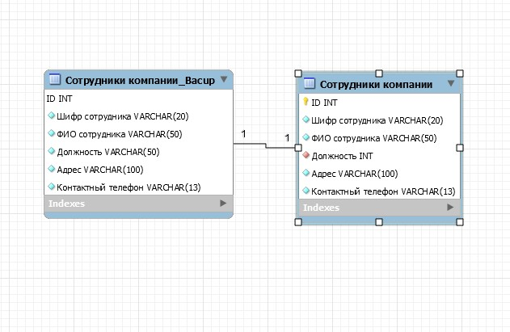
[.text-center]
Рисунок 1. Демонстрация связи один к одному.

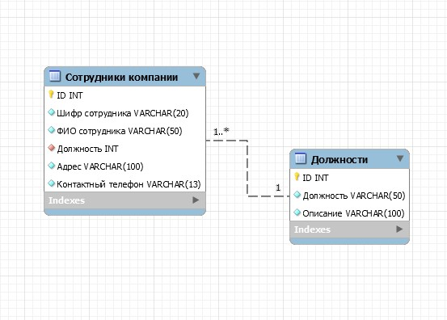
[.text-center]
Рисунок 2. Демонстрация связи один ко многим.

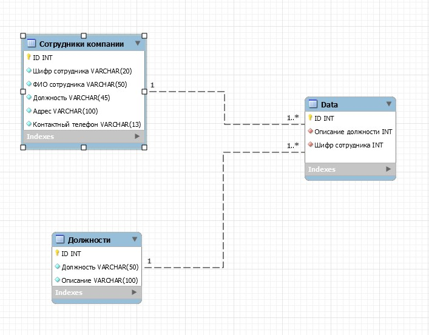

[.text-center]
Рисунок 3. Демонстрация связи многие ко многим.

[.text-left]
&#160; Рассмотрим пример описания связи функциональной зависимости между атрибутами «Должность» и «ID» сущностей «Сотрудники компании» и «Должности» ИС «Магазин компьютерной техники»: +
*таблица «Должности» атрибут «ID» (ключевое поле) → таблица «Сотрудники компании» атрибут «Должность».* __Тип связи один ко многим__: каждому значению атрибута «Должность» таблицы «Сотрудники компании» соответствует множество значений атрибута «ID» таблицы «Должности»; __данная связь является обязательной__, поскольку любой экземпляр типа «ID» сущности «Должности» должен участвовать в экземпляре типа «Должность» сущности «Сотрудники компании»; __кратность данной связи равна 1__, поскольку один атрибут «ID» сущности «Должности» должен участвовать в связи с атрибутом «Должность» сущности «Сотрудники компании», у таблицы «Должности» установлен простой первичный ключ, состоящий из одного атрибута; __связь является однозначно идентифицирующей__, поскольку экземпляр «ID»  сущности потомка «Должности» однозначно определяется своей связью с экземпляром «Должность» сущности родителя «Сотрудники компании»;

[.text-left]
=== *ER диаграммы*
&#160; На данном этапе необходимо построить модель, иллюстрирующую сущности и связи между ними, которые были выделены в ходе применения нормализации: 1НФ, 2НФ, 3НФ и, при наличии составных ключей, НФБК. Для построения модели нормализованной БД используется ER диаграмма, или диаграмма сущность связь. Различают физическую и логическую модель данных. Логическая модель представляет данные в общем виде, так как они выглядят в реальном мире. Физическая модель проектируется под каждую СУБД отдельно и отображает данные в виде группы сущностей со связями между ними, которые содержат атрибуты с типами данных, зарезервированных в определении конкретной СУБД. Для построения физической модели можно использовать программу MySQL Workbench, входящую в стандартный пакет MySQL Community, MS Visio или другое ПО для графического представления структуры БД. В качестве образца при построении физической модели также можно ориентироваться на схему данных, автоматически построенную программой MS Access, но при написании пояснительной записки необходимо будет использовать программу MS Visio. Ниже приведен пример, демонстрирующий описание физической и логической модели структуры БД ИС «Магазин компьютерной техники», полученной в ходе третьего этапа нормализации:

. _логическая модель данных_
* таблица "Заказы" + 
атрибуты: ID, шифр заказа, шифр сотрудника, количество заказанных товаров, ФИО заказчика, стоимость заказа, способ доставки, адрес доставки, контактный телефон, состояние заказа, дата оформления заказа, комментарий;
* таблица "Сотрудники компании" +
атрибуты: ID, шифр сотрудника, ФИО сотрудника, должность, адрес, контактный телефон;
* таблица "Должности" +
атрибуты: ID, должность, описание;
* таблица "Состояние заказа" +
атрибуты: ID, шифр заказа, шифр товара, количество единиц товара, промежуточная стоимость;
* таблица "Товары" +
атрибуты: ID, шифр товара, фирма поставщик, название товара, поставлено на склад, текущее количество товара на складе (баланс), стоимость одной единицы товара (цена), рейтинг продаж, наличие, комментарий;
* таблица "Фирмы поставщики" +
атрибуты: ID, название фирмы, адрес, комментарий;
* таблица "способы доставки" +
атрибуты: ID, способ доставки;
. _физическая модель данных_

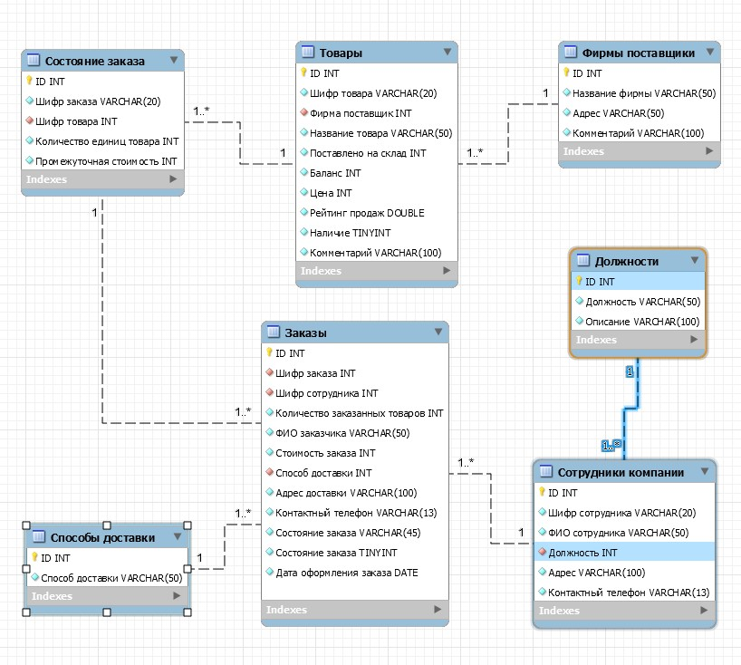
[.text-center]
Рисунок 4. Физическая модель данных.

== [brown]#Этап 3#
[.text-left]
=== *Цель этапа*

&#160; Целью данного этапа является реализация и описание функционала базы данных: создание таблиц со связями, а также триггеров, процедур, функций, курсоров и представлений.

[.text-left]
=== *Введение*

&#160; В ходе данного этапа должна получиться готовая модель БД, которая включает в себя сущности, нормализованы до третьей или усиленной третьей нормальной формы с установленными связями между атрибутами, процедуры, функции и триггеры. Если Вы выполняли ЛР №3 по дисциплине «Управление данными», то вы уже должны иметь нормализованные до третьей нормальной формы таблицы с установленными связями. Если же нормализованной модели не имеется, в следующем пункте работы приводится описание как создавать таблицы и устанавливать связи между ними. Во втором пункте данной работы описывается, как создавать различные методы: процедуры, функции, триггеры. Ниже представлены определения процедуры, функции и триггера: +

. _процедура_ – метод, который позволяет выполнить некоторые действия с данными в БД. Может принимать входные параметры и изменять их в ходе работы. Не возвращает значений;
. _функция_ – метод, который позволяет обрабатывать данные в БД. Имеет определенный тип возвращаемы значений, может принимать входные параметры, но не может изменять их в ходе работы. В отличии от процедуры, возвращает входные параметры, или параметры в качестве результата работы;
. _триггер_ – специальный метод в БД, который позволяет обрабатывать всевозможные события: добавление, удаление, выбор, обновление записей в таблиц до и после выполнения запроса;
. _курсор_ - временный набор строк, которые можно перебирать последовательно, с первой до последней;
. _представление_ - бъект данных который не содержит никаких данных его владельца, а выбирается из связанных с ним сущностей с помощью запроса. 

=== *Создание таблиц и установка свзязей между ними*

&#160; Если у Вас нет нормализованной модели данных или же она составлена неверно, необходимо сначала необходимо ее создать. Согласно разработанной модели на предыдущем этапе курсового проектирования создайте таблицы, установите связи между ними и наполните их данными. Помните, от того насколько верно построена модель зависит корректность и простота написания запросов к сущностей, которые в ней расположены и уменьшается вероятность получения ошибки при выполнении запроса. +
&#160; Для создания таблицы откройте через командную строку программу MySQL.exe, по умолчанию она расположена по следующему пути: C:\Program Files\MySQL\MySQL Server 8.0\bin, и зайдите под пользователем root. +
&#160;Проанализируйте модель, созданную на предыдущем этапе курсового проектирования, и выделите все ссылочные сущности (таблицы, которые не имеют внешних ключей). Вначале необходимо создать и наполнить данными именно их, поскольку позже при помощи создания таблиц, имеющих атрибуты содержащие внешние ключи, будет создана ссылка на уже созданные ссылочные таблицы. Перед созданием модели необходимо создать и выбрать базу данных. &#160;Синтаксис для создания БД: +
[source,SQL]
----
Create database <Database name>;
----

&#160;Выбор БД: +
[source,SQL]
----
Use <Database Name>;
----
&#160;Синтаксис для создания ссылочной таблицы: +
[source,SQL]
----
Create table <Table name> (Column_1  Type_1  [Type_2,Type_3,…,Type_n],Column_2  Type_1  [Type_2,Type_3,…,
Type_n],…,Column_n  Type_1  [Type_2,Type_3,…,Type_n]);
----

&#160;В данном синтаксисе _Type_ описывает характеристику каждого атрибута сущности, какого типа данных является атрибут, являются ли каждый экземпляр множества его значений уникальным (Unique), является ли оно автоинкрементным (auto_increment)  и может ли принимать экземпляры множества его значений значения Null (Not Null). Полный список характеристик для атрибутов таблицы можно получить, обратившись к https://sql.itsoft.ru[спарвочной документации] или при создании таблицы в MySQL Workbench. Иллюстрация типов данных и характеристик атрибутов иллюстрирует рисунок 5. При создании как ссылочной, так и внешней таблицы, первым атрибутом следует указать первичный ключ ID. Для него стоит выбрать тип данных int или integer, задать свойства атрибута Not null и автоинкремент. *Важно задать названия атрибутов на английском языке и по возможности не использовать разделители (_, #, %) и т.д.* Несмотря на то, что поздние версии MySQL работают с кодировкой ASCII, допускающее русское именование элементов и названий атрибутов, атрибуты и сущности принято называть на английском языке, который является международным.

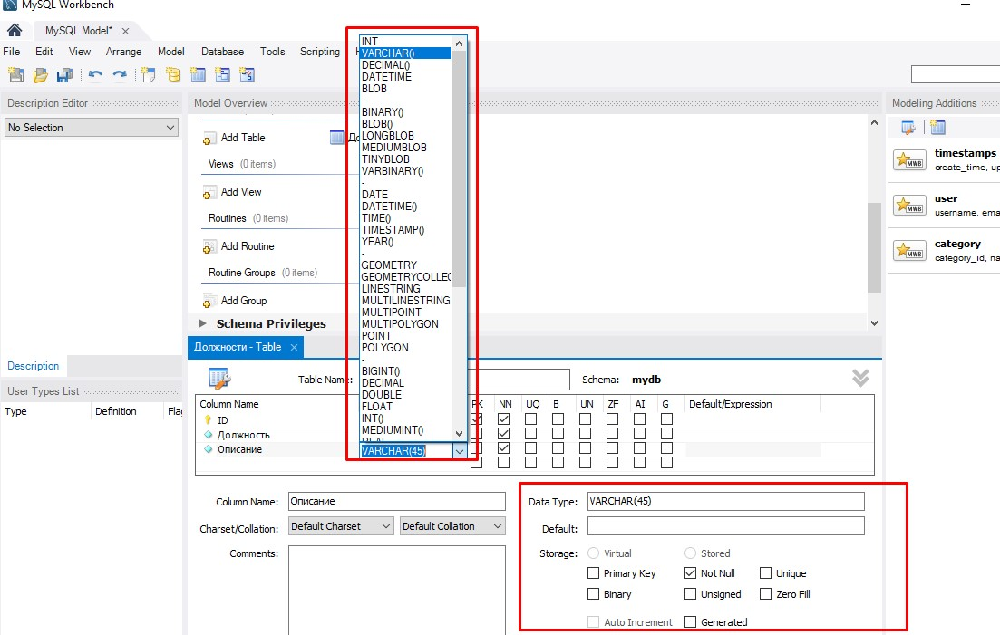
[.text-center]
Рисунок 5. Типы данных, определенные в системе MySQL.

[.text-left]

&#160;Пример описания скрипта кода для создания ссылочной сущности «Должности» имеет вид:

[source,SQL]
----
Create Table Positions (ID primary key not null integer auto_increment, Position varchar (10) not null unique, Explanation varchar (100));
----
&#160;После создания всех ссылочных таблиц создайте и наполните данными ссылающиеся сущности. В отличии от ссылочных сущностей, ссылающиеся сущности содержат внешние ссылки на другие сущности, которые создаются при помощи внешних ключей. Синтаксис для описания ссылающейся сущности следующий:
[source,SQL]
----
create table <Table Name>
(Column_1  Type_1  [Type_2  Type_3  … Type_n],Column_2  Type_1  [Type_2 Type_3 … Type_n],…,Column_n Type_1  [Type_2  Type_3  … Type_n],foreign key
(<one of [Column_1,Column_2,…,Column_n ]>)  references <Daughter Table
Name> (Atribute name)  constraint<FK Name>[ON DELETE CASCADE]; 
----

&#160;в данном синтаксисе _Table Name_ – название ссылающейся таблицы, Column – название столбца, _Type_ – характеристика атрибута (столбца таблицы),  _<One of Column_1, Column_2,…,Column_n>_  название одного из атрибутов ссылающейся таблицы, _Daughter Table Name_ – имя ссылочной таблицы, куда необходимо поставить ссылку, _Attribute name_ – название атрибута ссылочной таблицы, _FK Name_ название внешнего ключа (благодаря названию ключа можно управлять созданной связью между сущностями: изменять, удалять); если свойство constraint не определено, его можно получить, обратившись к служебной БД Information_schema. 
&#160;Для изменения структуры уже созданной таблицы используйте тег alter. Синтаксис вызова данной команды, следующий:
[source,SQL]
----
alter <Table name> <command alter>
----
где Command alter обозначает операцию, которую, необходимо выполнить с таблицей. Схема, иллюстрирующая все методы команды Alter представлена ниже:

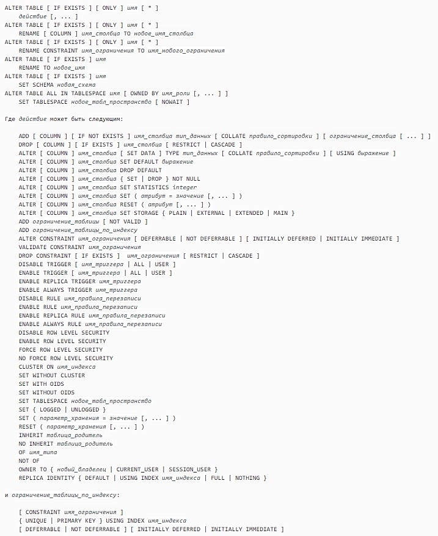
[.text-center]
Рисунок 6. Схема кроманды ALTER.

[.text-left]

&#160;Пример изменения названия атрибута Position на EmployeePosition и его типа созданной сущности представлен ниже:
[source,SQL]
----
Alter Positions change Position EmployeePosition varchar (30) not null;
----

&#160;Для переименования таблицы используйте команду:
[source,SQL]
----
rename table <Old Name> <New Name>;
----
пример переименования таблицы Positions в MyPositions:
[source,SQL]
----
rename table positions mypositions;
----
&#160;Обратите внимание, что название сущностей всегда отображается в прописном формате, независимо от того, использовались при задании имени буквы в верхнем регистре или нет. В отличии от названия сущности, название атрибутов зависит от регистра. В заключении выполним команду, которая отобразит структуру данных таблицы. Синтаксис данной команды следующий:
[source,SQL]
----
Describe <Table Name>;
----
где _Table Name_ – имя существующей сущности. Пример запроса:
[source,SQL]
----
Describe Positions;
----
для удаления уже созданной таблицы используйте команду:
[source,SQL]
----
Drop <Table name>;
----
где _Table name_ – название созданной таблицы. Также нужно учитывать, что для удаления ссылающейся сущности необходимо сначала удалить внешний ключ, связывающий ее с ссылочной сущностью или выключить проверку внешних ключей, воспользоваться командой:
[source,SQL]
----
set foreign_key_checks=0;
----
после удаления включите проверку, вызвав данную команду, предварительно поменяв 0 на 1. Но стоит понимать, что отключение проверки внешних ключей может привести к нарушению ссылочной целостности данных в сущностях. Ниже приведен пример создания ссылочной сущности «Должности» (Positions) и ссылающейся сущности «Сотрудники компании» (CompanyEmloyees):

* SQL код создания ссылочной сущности "Должности"
[source,SQL]
----
create table Positions(ID integer not null primary key auto_increment, Position varchar(45) not null unique, Description Varchar(100) not null unique);
----

Демонстрация работы

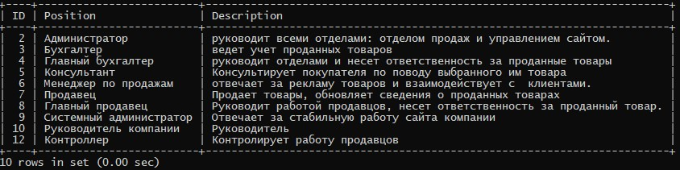
[.text-center]
Рисунок 7. Вид созданной сущности "Должности" в системе MySQL.

[.text-left]

* SQL код создания ссылающейся сущности "Сотруджники компании"
[source,SQL]
----
create table CompanyEmloyees (ID integer not null primary key auto_increment, EmployeeID varchar (45) not null unique, FullName varchar(45) not null, Position integer not null, Address varchar(45) not null, PhoneNumber Varchar(12) not null unique, constraint fk_CompanyEmployees_Positions foreign key (Position) references Positions (ID));
----

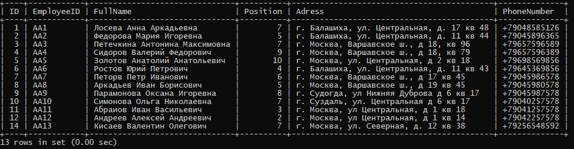
[.text-center]
Рисунок 8. Вид созданной сущности "Сотрудники компании" в системе MySQL.

[.text-left]
=== *Создание методов для оптимизации работы разрабатываемой ИС*

&#160; На данном этапе вам необходимо реализовать методы, которые были определены (и возможно дополнены в процессе работы над предыдущими этапами) методами – функции члены. Разделите их на несколько групп: 

. _первая группа,_ содержащая методы, которые не возвращают значений. Примером такого метода может быть сложный запрос на выборку, помещаемый в метод для оптимизации работы. Данные методы будут реализованы при помощи процедур;
. _вторая группа,_ содержащая методы, которые возвращают значения. Примером такого метода может служить получение должности сотрудника по его ID. Несмотря на то что запрос простой, частота использования его в ИС «Магазин компьютерной техники» довольно велика, поэтому стоит выделить его в отдельный метод. Данные методы будут реализованы при помощи функций;
. _третья группа,_ включающая методы, обрабатывающие события при работе с сущностями до и после их вызова. Например, автоматический расчет стоимости заказа, как произведение количества заказанных товаров на их суммарную цену. Обработка событий выполнения запросов до и после их выполнения к сущностям организуется при помощи триггеров;
. _четвертая группа_ включает в себя разработку представлений, содержащих данные атрибутов из одной или нескольких сущностей. Представления бывают изменияемые и неизменяемые. Изменяемые представления помимо запроса на выборку поддерживают выполнение запросов добавления, удаления и обновления, в то время как неизменяемые представления поддерживают только выбор данных. при создании изменяемых представлений сотит учитывать, что они должны быть точной копией связанной с ним сущности, поскольку иначе запросы в данном представлении будут выполняться некорректно. на неизменяемых представлений это ограничение по созданию не распространяется;
. _пятая группа_ включает в себя методы (чаще всего процедуры), в которых необходимо производить последовательную обработку нескольких подряд идущих кортежей одной или нескольких сущностей. Данную задачу в настоящее время решается при помощи создания куросоров;

Ниже приводятся синтаксис каждого метода и пример создания для ИС "Магазин компьютерной техники":

==== Процедуры

&#160;Ниже представлен синтаксис, пример и демонстрация работы созданной процедуры:

&#160;Синтаксис создания метода:
[source,SQL]
----
Delimiter $$
Create procedure <Procedure name>([<in,out,inout> paramname_1  
type_1  [type_2  … type_n ],…,<in,out,inout> paramname_n  type_1  [type_2… type_n]])
Begin
	[some operations]
	[Declare LocalVariable Type_1 [Type_2,Type_3,…,Type_n]];
	[Some select, insert, update or delete query]
End$$
Delimiter ;
----

&#160;В данном шаблоне применены следующие обозначения: _procedure name_ – название процедуры; _[<in, out, inout>]_ – тип модификаторов параметров входных переменных в процедуре: +

. *in* – модификатор, задающий параметр входной переменной, используется по умолчанию; +
. *out* – модификатор, применяющийся для определения переменной, возвращающей значение; +
. *inout* – модификатор, характеризующий переменную, которая является входным параметром и параметром, возвращающим значение; +

объявление параметров в процедуре не обязательно, это показывает обрамление множества входных параметров в квадратные скобки. В теле процедуры может выполняться запрос на выборку удаление, обновление или добавление, могут объявляться локальные переменные при помощи ключевого слова _declare_, а также вызываться встроенные или уже определенные ранее методы. При написании синтаксиса процедуры необходимо не забыть переопределить разделитель _delimiter_. Вызываются процедуры при помощи ключевого слова _call_. При необходимости можно удалить созданную процедуру, используя ключевое слово _drop_. Ниже приведен синтаксис и демонстрация работы процедуры, добавляющий очередного сотрудника в сущность "Сотрудники компании":
[source,SQL]
----
->override delimiter:
delimiter $$
->create procedure:
create procedure AddComanyEmployees(in FName varchar(45), in Pos varchar (45), in adr varchar (45), in PNumber varchar(12))
begin
	declare empid varchar(45);
    declare id_p int;
	set empid=CONCAT('AA',(select count(*)+1 from companyemployees));
	set id_p=-1;
	select id into id_p from positions where position = Pos;
	if (id_p>0) then
	    insert into CompanyEmployees (EmployeeID, FullName, Position, Adress, PhoneNumber) values (empid, FName, id_p, adr, PNumber);
 	else select 'Please, check the entered values are correct' as error;
 	end if;
end$$
->return the default value to the delimiter:
delimiter ;
->call procedure:
call AddComanyEmployees ('Кисаев Bалентин Oлегович','Продавец','г. Москва, ул. Северная, д. 12 кв 38', '+79256548592');
->remove procedure:
drop procedire [if exists] AddCompanyEmployees;
----
Демонстрация работы

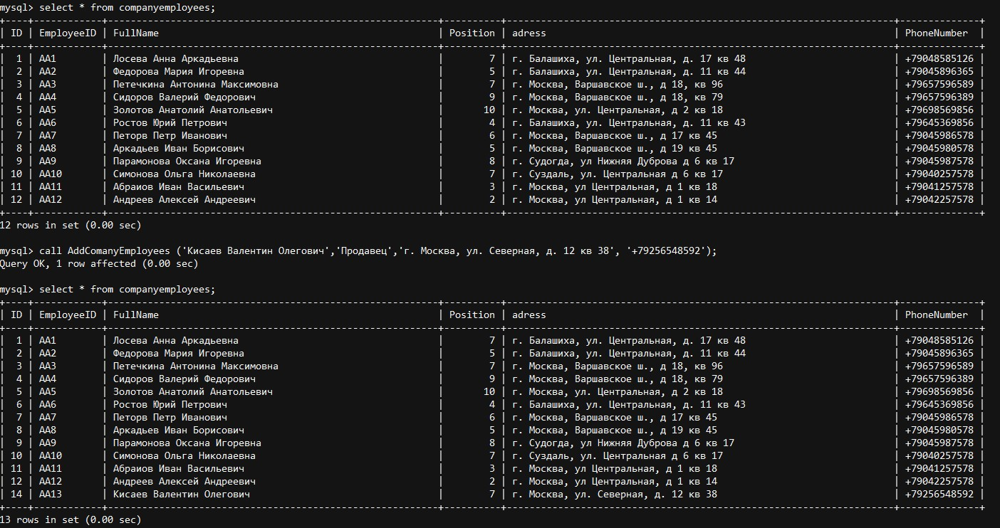
[.text-center]
Рисунок 9. Демонстрация работы созданной процедуры "AddCompanyEmployees".

[.text-left]

==== Функции

&#160;Ниже представлен синтаксис, пример и демонстрация работы созданной функции: +
&#160;Синтаксис создания метода:
[source,SQL]
----
Delimiter ##
Create function <Function name> ([paramnane_1  type_1  [type_2…type_n],
 …,paramname_n  type_1  [type_2  … type_n]])
Renurs ReturnType
[Un]Deterministic
Begin
[Declare LocalVariable type_1  [type_2… type_n ]]  
//method body 
[some operations]
[some insert,update,delete or select query]
Return SomeObject;
End##
Delimiter ;
----
&#160;В данном шаблоне применены следующие условные обозначения: _Function name_ – название функции; _paramname_ – название входного параметра; _type_ – тип входного параметра; _ReturnType_ – тип возвращаемого значения функции (главное отличие от процедур); _[Un]Deterministic_ – характеристика функции, указывающая будет ли она выполняться на нескольких серверах одновременно (determemistc), или нет (undeterministic); _LocalVariable_ – название локальной переменной (не обязательный параметр); SomeObject – метод, запрос или переменная, возвращаемый или тип которой совпадает с типом возвращаемого значения функции __ReturnType__.
&#160;В отличии от процедуры функция __обязана возвращать значение определенного типа__. В теле функции можно объявить, а затем вернуть после ряда операций, переменные, выполнить запрос, а также вызвать ранее созданные или зарезервированные методы. Также стоит помнить, что модификаторы __in, out и inout__ для входных параметров в функции не применяются. Вызываются функции с применением зарезервированного слова select. При необходимости можно удалить созданную функцию, используя ключевое слово __drop__. Ниже представлен код для создания и демонстрация работы функции **GetInterMediateCost**, возвращающей стоимость заказываемого товара по введенному шифру товара и его количеству. Функция обращается к сущности "Товары", выбирает цену товара и умножает на введенное количество, а затем возвращает стоимость в формате int:
[source,SQL]
----
->override delimiter:
delimiter $$
->create function:
create function GetIntermediateCost(productID char(45), cout int)
returns int
deterministic
begin
return(select cout*UnitPrice from products where ProductCipher=productid and Availability=true);
end$$
->return the default value to the delimiter:
delimiter ;
->call function:
select GetIntermediateCost('aaa1',4);
->remove function:
drop function [if exists] GetIntermediateCost;
----

Демонстрация работы

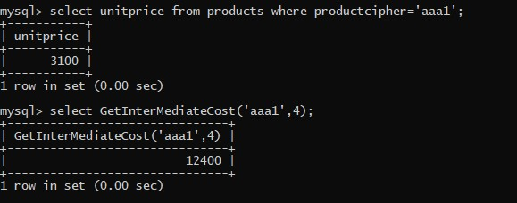
[.text-center]
Рисунок 10. Демонстрация работы созданной функции "GetIntermediateCost".

[.text-left]

==== Триггеры

&#160;Ниже представлен синтаксис, пример и демонстрация работы созданного триггера: +
&#160;Синтаксис создания метода:
[source,SQL]
----
Create trigger <TriggerName> <Event> <QueryType>ON 
<TableName> 
FOR EACH ROW<Expression>
----
&#160;В данном шаблоне применены следующие условные обозначения: _TriggerName_ – название триггера; _Event_ – параметр, который задает время выполнения триггера: после выполнения (After) запроса  к сущности __TableName__, или до него (Before); _QueryType_ – тип запроса, который будет обрабатываться триггером: insert, select, delete или update; _TableName_ – называние сущности, которую будет контролировать триггер; _Expression_ – выражение, которое будет выполняться при вызове триггера, может быть заключено в блок **begin end**, иметь один или несколько вызываемых методов или запросов, а также локально объявленные переменные. Ниже приведен синтаксис триггера, который обновляет цену товара перед каждым добавлением очередного кортежа в сущность "Состояние заказа":
[source,SQL]
----
->override delimiter:
delimiter $$
->create trigger:
create trigger ControlToInsertIntoOrderStatus before insert on OrderStatus
for each row
begin
update products set Balance=Balance-new.ProductCout where id=new.ProductCipher;
end$$
->return the default value to the delimiter:
delimiter ;
->remove trigger:
drop trigger [if exists] ControlToInsertIntoOrderStatus;
----

Демонстрация работы

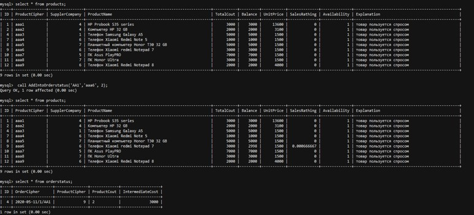
[.text-center]
Рисунок 11. Демонстрация работы созданного триггера "ControlToInsertintoOrderStatus".

[.text-left]
==== Представления

&#160;Ниже представлен синтаксис, пример и демонстрация работы созданного представления: +
&#160;Синтаксис создания метода:
[source,SQL]
----
CREATE [OR REPLACE]
[ALGORITHM = {UNDEFINED | MERGE | TEMPTABLE}]
VIEW View Name [(column list)]
AS select_statement
[WITH [CASCADED | LOCAL] CHECK OPTION]
----
&#160;В данном шаблоне применены следующие обозначения:

. _View Name_ - имя создаваемого представления;
. _select statement_ - select запрос к сущности, откуда будут загружаться данные;
. _Algorithm_ - алгоритм, используемый при обращении к представлению. Определены следующие значения для данного модификатора:
* undefied - стандартный модификатор доступа;
* merge - "объединение", служит для создания [underline]#изменяемых# представлений;
* temptable  - "временные таблицы", служит для создания [underline]#неизменяемых# представлений;
. _column list_ - задает имена атрибутам в представлении. Важно, чтобы число атрибутов, возвращаемых запросом _select statement_ и число определенных атрибутов в _column list_ совпадало;
. _or replace_ - при использовании данной конструкции в случае существования представления его определение будет презаписано;
. _with check option_ - при использовании данной конструкции все изменения, вносимые в представления (добавления и обновления) будут проверяться на соответствии с его определением;

&#160;Ниже приведен пример создания неизменяемого представления ActiveProducts, содержащая даннные о товарах в наличии:
[source,SQL]
----
->create view:
create or replace algorithm=temptable view ActiveProducts as select Products.ID, ProductCipher, s.CompanyName, ProductName, TotalCout, Balance, UnitPrice, SalesRathing from products, supplercompanies s where products.supplercompany=s.id and Availability=true group by ProductCipher;
->remove trigger:
drop view [if exists] ActiveProducts;
----

Демонстрация работы

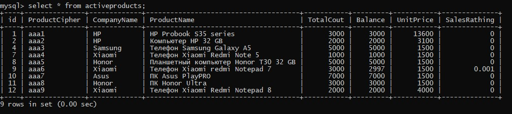
[.text-center]
Рисунок 12. Демонстрация работы созданного неизменияемого представления "ActiveProducts".

[.text-left]
==== Курсоры

&#160;Ниже представлен синтаксис, пример и демонстрация работы созданного курсора: +
&#160;Синтаксис создания метода (расширенный):
[source,SQL]
----
DECLARE cursor name CURSOR [LOCAL | GLOBAL]
[FORWARD_ONLY | SCROLL ]
[STATIC | KEYSET | DYNAMIC | FAST_FORWARD]
[READ_ONLY | SCROLL_LOCKS | OPTIMISTIC]
[TYPE_WARNING]
FOR select statement
[FOR UPDATE [OF column_name [,...n]]][;]
----
&#160;В данном шаблоне применены следующие обозначения:

. _coursor name_ - имя создаваемого курсора;
. _select statement_ - select запрос к сущности, откуда будут загружаться данные;
. _insensitive_ - определяет курсор, который создает временную копию данных для использования курсором;
. _scrool_ - Указывает, что доступны все параметры выборки (FIRST, LAST, PRIOR, NEXT, RELATIVE, ABSOLUTE);
. _select statement_ - стандартная инструкция SELECT, которая определяет результирующий набор курсора;
. _READ ONLY_ - предотвращает изменения, сделанные через курсор;
. _UPDATE [OF column_name [ , ...n]]_ - определяет обновляемые столбцы в курсоре;
. _LOCAL_ - указывает, что курсор является локальным по отношению к пакету, хранимой процедуре или триггеру, в котором он был создан;
. _GLOBAL_ - указывает, что курсор является глобальным по отношению к соединению;
. _FORWARD_ONLY_ - указывает, что курсор может перемещаться только вперед и просматриваться от первой строки к последней;
. _STATIC_ - указывает, что курсор всегда отображает результирующий набор в том виде, который он имел на момент первого открытия курсора, и создает временную копию данных, предназначенную для использования курсором;
. _KEYSET_ - указывает, что членство или порядок строк в курсоре неизменны при его открытии;
. _FAST_FORWARD_ - азывает курсор FORWARD_ONLY, READ_ONLY, для которого включена оптимизация производительности;
. _SCROOL_LOCKS_ - указывает, что позиционированные обновления или удаления, осуществляемые с помощью курсора, гарантированно будут выполнены успешно;
. _OPTIMISTIC_ - указывает, что позиционированные обновления или удаления, осуществляемые с помощью курсора, не будут выполнены, если с момента считывания в курсор строка была обновлена;
. _TYPE_WARNING_ - указывает, что клиенту будет отправлено предупреждение, если курсор неявно будет преобразован из одного запрашиваемого типа в другой;

&#160;Ниже приведен пример создания курсора _cur1_, размещенного в процедуре _GetInfoWithCoursor_, осуществляющую снижение цены каждого товара (атрибут UnitPrice в сущности Products) в наличии на 20%:
[source,SQL]
----
Create procedure GetInfoWithCoursor()
begin
declare done int default 0;
declare a int;
declare cur1 cursor for select UnitPrice from products where
Availability=true;
DECLARE CONTINUE HANDLER FOR SQLSTATE '02000' SET done = 1;
open cur1;
repeat 
  fetch cur1 into a;
  if not done then
  update products set UnitPrice=UnitPrice-a*0.2 where Availability=true;
  end if;
until done end repeat;
close cur1;
end$$
----

Демонстрация работы

image::images/coursor_example.jpg["Coursor", width=1500, link="images/coursor_example.jpg", align=center]
[.text-center]
Рисунок 13. Демонстрация работы курсора _cur1_, вызываемого в процедуре _GetInfoWithCoursor_.

[.text-left]
=== *Пример описания метода*

&#160;Реализовав все методы разрабатываемой ИС, предоставьте описание каждого из них. Раскройте назначение и краткий принцип работы каждого метода разрабатываемой подсистемы в виде списка, а затем предоставьте SQL код методов и скриншоты работы. Ниже приведен пример описания функции GetIntermediateCost, возвращающей стоимость товара по введенному шифру товара и его количеству:

. *GetIntermediateCost* - возвращает стоимость заказываемого товара по введенному шифру товара и его количеству.
&#160;SQL код создания сущности:
[source,SQL]
----
create function GetIntermediateCost(productID char(45), cout int)
returns int
deterministic
begin
return(select cout*UnitPrice from products where ProductCipher=productid and Availability=true);
end$$
----
&#160;Демонстрация работы метода:

[.text-center]
Рисунок 14. Демонстрация работы созданной функции "GetIntermediateCost".

[.text-left]

== [brown]#Этап 4#
[.text-left]
=== *Цель этапа*
&#160;Целью данного этапа является выполнение окончательной реализации всех объектов, описанных в базе данных и демонстрацию работы реализованного функционала в виде скриншотов.

=== *Ход выполнения этапа*
&#160;На данном этапе необходимо проанализировать модель данных и устранить лишние связи и сущности, при необходимости добавить новые сущности и установить новые связи. Модель, полученная на данном этапе в результате анализа, будет являться финальной и будет включена в пояснительную записку. После анализа данных предоставьте синтаксис созданных ссылочных и ссылающихся сущностей, процедур, функций и триггеров и демонстрацию их работы. На предыдущем этапе описывалось, как создать методы и сущности. Важно убедиться, что система работает стабильно, корректно данные корректно добавляются в ссылочные таблицы при добавлении или удалении данных в ссылающиеся таблицы.

== [brown]#Этап 5#
[.text-left]
=== *Цель этапа*
&#160;Целью данного этапа является оформление пояснительной записки, раскрывающей проделанную работу и оформленную согласно стандартам.

=== *Требования к оформлению пояснительной записки*

&#160;Для создания пояснительной записки используйте шаблон, прилагающийся к методичке или посмотрите в http://https://www.rosdiplom.ru/rd/pubdiplom/view.aspx?id=473[интернет источниках], какие требования выдвигаются для создания пояснительной записки. Ниже перечислены основные требования для документа: +

. поля: сверху 0,64; снизу 0,64; справа 0,78; слева 2;
. интервал 1,0;
. выравнивание текста по ширине;
. _стили:_ для заголовков использовать шаблон «Заголовок 2», сменив шрифт на Times New Roman, кегль 16, жирный; основной тест: шрифт Times New Roman, кегль 14; название подпунктов этапа: шрифт Times New Roman, кегль 14, жирный;
. красная строка имеет отступ 1,5 см;
. отступ от первой строки и отступ справа должны составлять 0,25 см;
. название документа печатается прописными буквами, шрифт Times New Roman, кегль 16;
. при написании списков используйте цифры (1.,2.,3.,…n) выступ 1,0 см, отступ от первой строки 0,5 см; в конце ставьте точку с запятой; новый элемент списка начинается со строчной буквы;

_Пояснительная записка представлеят собой:_

. папка скоросшиватель;
. пояснительная записка, состоит из
* титульный лист;
* лист задания;
* аннотация на русском и английском языках;
* содержание (с рамкой);
* разделы пояснительной записки (с рамками);
* приложения (без рамок);
* графический материал (в отдельном файле);
* файл для страниц с ошибками, пустой, на следующем этапе туда будут вложены страницы пояснительной записки, которые были перепечатаны;
* подписанный диск в подшитом к папке конверте, содержащий: разработанные коды, пояснительная записка, графический материал, презентация; +

*Объем пояснительной записки должен находиться в пределах 20-25 страниц!*

_Требобания к оформлению презентации:_

&#160;Презентация должна отражать всю проделанную работу, при ее создании необходимо раскрыть следующие аспекты:

. цель работы, включающая пункты подраздела «Цели и  задачи решаемые в подсистеме хранения данных» этапа №1;
. синтаксис разработанных объектов в системе (сущности и методы) и демонстрация их работы в виде скриншотов;
. выводы по работе; +

&#160;Для визуализации можно применить анимацию и стили слайдов. При разработке презентации не стоит подробно описывать кожный этап, а передать суть выполненной работы: __время защиты каждой работы составляет 5 минут!__.

== [brown]#Этап 6#
[.text-left]
=== *Цель этапа*
&#160;Целью данного этапа является ознакомление с процессом защиты курсового проекта.

=== *Содержание этапа*

&#160;Для защиты используется презентация, которая была разработана на предыдущем этапе. Для каждой работы время защиты составляет 5 минут. Во время защиты преподаватель будет задавать вопросы теоретического и практического характера, относящиеся к разрабатываемой работе и проверяющие понимание основных понятий реляционной алгебры и структуру БД: БД, СУБД, сущность, связи, их виды, атрибут, кортеж и т.д.

== [brown]#Список рекомендуемой литературы#

. Е. П. Моргунов. Язык SQL. Базовый курс. Учебно практическое пособие — М.: Компания Postgres Professional, 2017. — 257 с. — УДК 004.655;
. Справочная документация MySQL от Oracle;
. Грофф Джеймс Р. "SQL. Полное руководство". - Диалектика/Вильямс, 2016 - 960 с. ISBN 978-5-8459-1654-9;